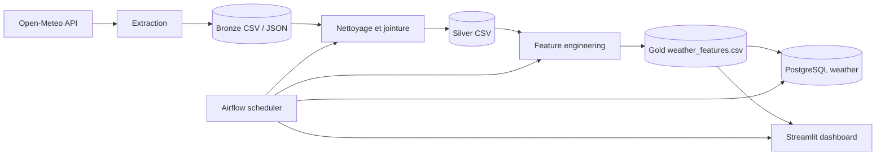
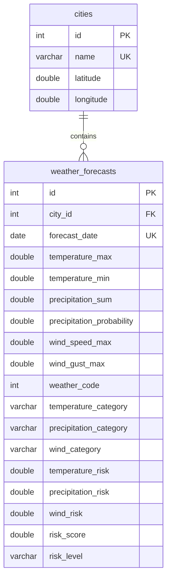

# Daily Weather

Pipeline de données météo pour le Maroc. Le projet collecte des prévisions météo, nettoie et transforme les données, calcule un score de risque, les charge dans PostgreSQL et les présente dans un dashboard Streamlit.

## Architecture



La stack Docker Compose contient :

- **PostgreSQL 16** : données métier dans la base `weather` et métadonnées Airflow dans la base `airflow`.
- **Airflow 3.3.2** : orchestration du DAG `etl-weather`.
- **Streamlit** : visualisation des prévisions et des niveaux de risque.

## API choisie

Le projet utilise [Open-Meteo](https://open-meteo.com/) pour récupérer les prévisions météo sans clé API.

Endpoint par défaut :

```text
https://api.open-meteo.com/v1/forecast
```

Pour chaque ville, l’extraction demande une prévision à 7 jours avec :

- températures maximale et minimale ;
- précipitations et probabilité de précipitation ;
- vitesse et rafales de vent ;
- code météo.

Les erreurs transitoires `429`, `500`, `502`, `503` et `504` sont retentées avec un backoff exponentiel.

## DAG Airflow

Le DAG s’appelle `etl-weather` et s’exécute quotidiennement (`@daily`, sans catchup).

Workflow actuellement actif :

```text
clean_and_join
      ↓
feature_engineering
      ↓
load_postgres
      ↓
refresh_dashboard
```

L’étape `extract_weather` est actuellement commentée dans `airflow/dags/weather_pipeline.py`. Pour exécuter l’extraction via Airflow, réactiver l’opérateur `extract_weather` et sa dépendance dans le DAG.

## Schéma du data warehouse

La base métier est PostgreSQL, dans la base `weather`.



Contraintes principales :

- une ville est unique par son nom ;
- une prévision est unique pour un couple `city_id` / `forecast_date` ;
- `weather_forecasts.city_id` référence `cities.id`.

Le schéma est initialisé par `docker/postgres/init/02-schema.sql`.

## Prérequis

- Docker Engine
- Docker Compose v2+
- Environ 4 Go de mémoire disponible pour Airflow et PostgreSQL

Vérifier l’installation :

```bash
docker compose version
docker version
```

## Installation et démarrage

Depuis la racine du projet :

```bash
git clone <url-du-repository>
cd Daily-Weather
docker compose up -d --build
```

Les interfaces sont disponibles ici :

- Streamlit : <http://localhost:8501>
- Airflow : <http://localhost:8080>
- PostgreSQL depuis l’hôte : `localhost:5433`

Identifiants Airflow par défaut pour le développement :

```text
Utilisateur : admin
Mot de passe : admin
```

Ces valeurs peuvent être remplacées dans `.env` :

```dotenv
POSTGRES_USER=alaric
POSTGRES_PASSWORD=alaricius
POSTGRES_DB=weather
AIRFLOW_ADMIN_USERNAME=admin
AIRFLOW_ADMIN_PASSWORD=admin
API_URL=https://api.open-meteo.com/v1/forecast
```

Ne jamais utiliser ces identifiants par défaut en production.

## Utilisation d’Airflow

Lister les DAGs :

```bash
docker compose exec airflow-api-server airflow dags list
```

Déclencher le DAG manuellement :

```bash
docker compose exec airflow-api-server airflow dags trigger etl-weather
```

Récupérer le dernier `run_id` :

```bash
docker compose exec airflow-api-server airflow dags list-runs etl-weather
```

Consulter l’état d’un run en remplaçant la valeur par un vrai identifiant :

```bash
docker compose exec airflow-api-server \
  airflow tasks states-for-dag-run etl-weather \
  'manual__2026-09-19T14:30:42.113264+00:00'
```

Suivre les logs du scheduler :

```bash
docker compose logs -f airflow-scheduler
```

Les logs détaillés d’une tâche sont accessibles dans l’interface Airflow :

```text
DAGs → etl-weather → DAG Run → Task → Logs
```

## Accès PostgreSQL

Connexion depuis le conteneur PostgreSQL :

```bash
docker compose exec postgres psql -U alaric -d weather
```

Vérifier les volumes chargés :

```sql
SELECT count(*) FROM cities;
SELECT count(*) FROM weather_forecasts;
```

## Tests

Les tests Python peuvent être exécutés dans l’environnement local :

```bash
source .venv/bin/activate
pytest
```

Pour tester une tâche Airflow isolément :

```bash
docker compose exec airflow-scheduler \
  airflow tasks test etl-weather clean_and_join \
  2026-09-19T15:00:00+00:00
```

## Captures d’écran du dashboard

Le dashboard est disponible après démarrage sur <http://localhost:8501>.

Captures recommandées :

1. Vue générale avec les quatre indicateurs : villes surveillées, jours de prévision, périodes à risque et score moyen.
2. Vue filtrée par ville et niveau de risque.
3. Tableau des prévisions météo générées.

Enregistrer les images dans `docs/screenshots/` puis les référencer ici :

```markdown


```

## Structure du projet

```text
.
├── airflow/
│   ├── dags/weather_pipeline.py
│   └── Dockerfile
├── dashboard/app.py
├── data/
│   ├── bronze/
│   ├── silver/
│   └── gold/weather_features.csv
├── docker/postgres/init/
├── src/
│   ├── extraction/
│   ├── transformation/
│   └── load/
├── tests/
├── Dockerfile
├── docker-compose.yml
└── requirements.txt
```

## Arrêt et nettoyage

Arrêter les services en conservant les données PostgreSQL :

```bash
docker compose down
```

Supprimer aussi le volume PostgreSQL :

```bash
docker compose down -v
```

La seconde commande supprime les bases `weather` et `airflow` du volume Docker.
